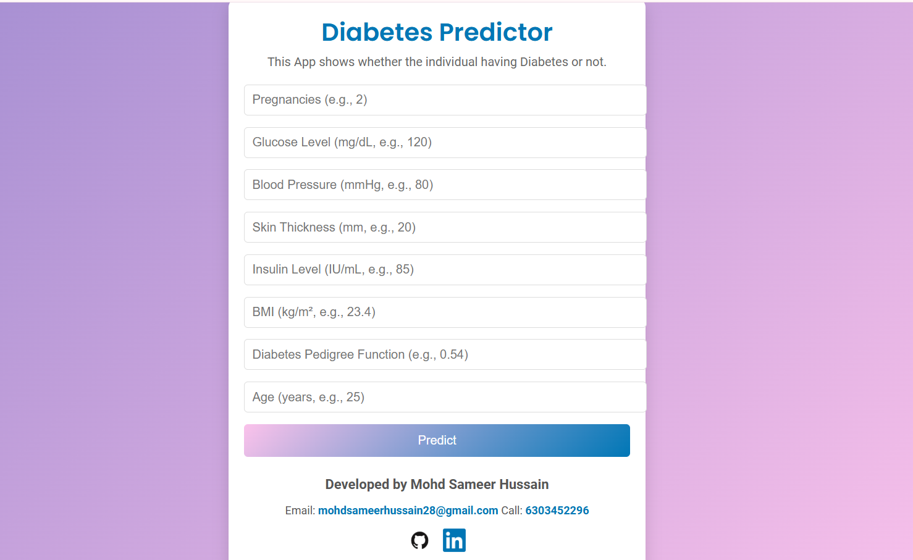
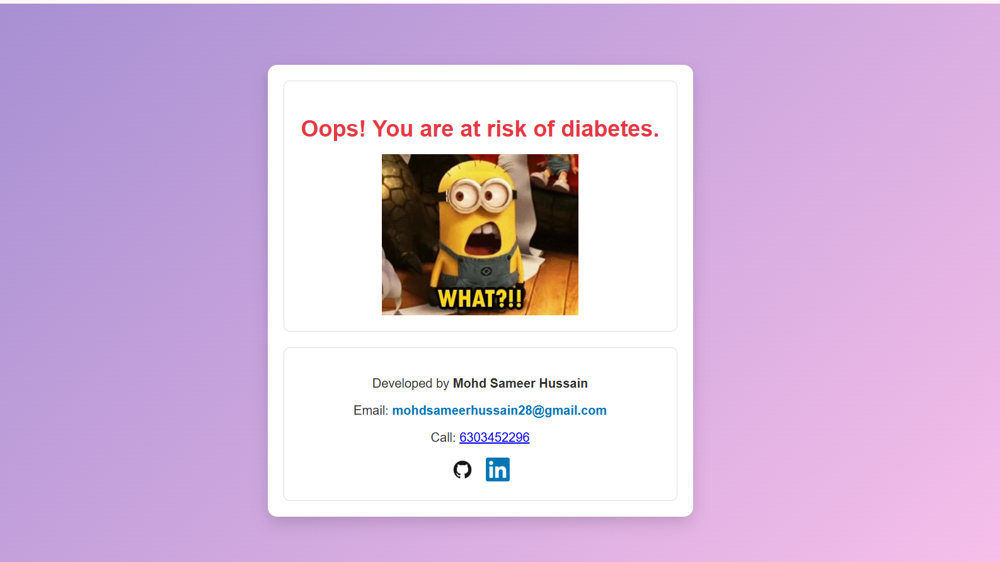

# Diabetes-Predictor-WebApp
An machine learning WebApp Project that classify individuals as having diabetic or non-diabetic based on medical parameters.

# Diabetes Predictor

A **Machine Learning App** built with **Flask** to predict the risk of diabetes based on user input. The application features a user-friendly interface, an attractive design, and interactive elements.

---

## 📌 Features

- Predicts the risk of diabetes using input values such as glucose level, BMI, age, etc.
- User-friendly interface with attractive gradient backgrounds and animations.
- Responsive design that works on different screen sizes.
- Displays clear results and includes contact information of the developer.
- Developed using **Flask**, **HTML**, **CSS**, and **Machine Learning**.

---

## 🚀 How It Works

1. The user enters personal and medical details (e.g., Glucose Level, Blood Pressure) into the input fields on the homepage.
2. The app processes the input using a pre-trained **Random Forest Classifier**.
3. The app displays the result:
   - **Oops! You are at risk of diabetes** (if the prediction is positive).
   - **Great! You are not at risk of diabetes** (if the prediction is negative).
4. Developer contact details and social links are displayed for further assistance.

---

## 🛠️ Tech Stack

- **Backend**: Flask (Python)
- **Frontend**: HTML, CSS
- **Machine Learning**: Scikit-learn
- **Model**: Random Forest Classifier

---

## 🖥️ Screenshots

### Homepage

### Result Page

